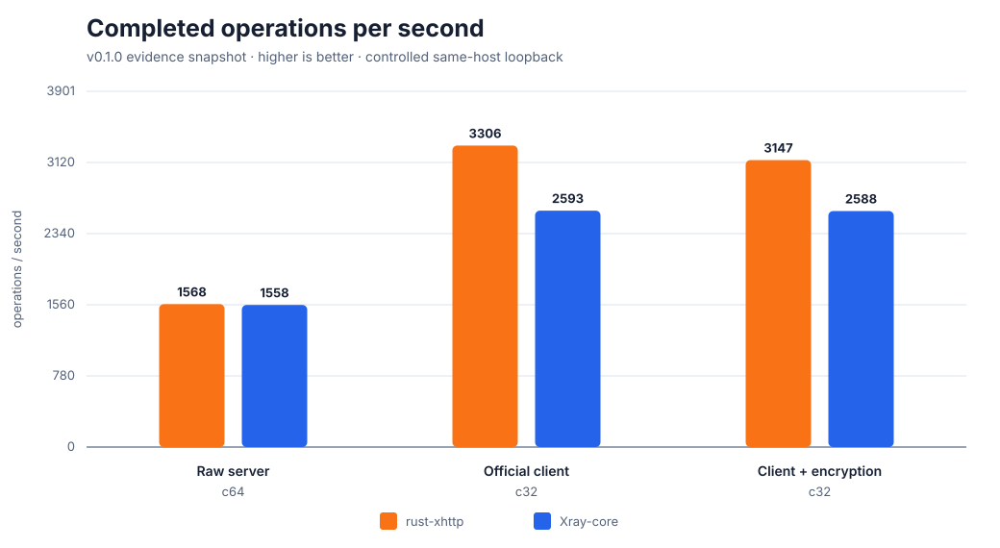

# rust-xhttp

[](https://github.com/jacek4yang/rust-xhttp/actions/workflows/ci.yml)
[](https://github.com/jacek4yang/rust-xhttp/releases/latest)
[](LICENSE)

[English](README.md) | 简体中文

`rust-xhttp` 是一个纯 Rust 服务端，与官方 Xray-core 客户端的 XHTTP 协议栈
线协议兼容：不需要修改客户端，不引入私有线格式，也不宣传所谓“零指纹”。实现行为
以 `local/references/Xray-core` 下的本地 Xray 源码为依据。

服务端协议栈：

```text
XHTTP (packet-up) + VLESS + VLESS-Encryption + xtls-rprx-vision + XUDP
```

> [!IMPORTANT]
> 这是 1.0 之前的安全敏感网络软件，尚未经过独立安全审计。内置 TLS 1.3 后端
> 已与 OpenSSL 客户端互操作，但不声称与 nginx/OpenSSL 的指纹完全等价；详见
> [`docs/tls-fidelity-analysis.md`](docs/tls-fidelity-analysis.md)。

同一个线协议支持三种部署方式，通过 Xray 风格 JSON 的
`streamSettings.security` 与监听地址选择：

- **直连** — `Xray 客户端 → Rust（内置 TLS 1.3 / H2）`
- **Cloudflare** — `Xray 客户端 → Cloudflare → Rust（H2 回源）`
- **nginx 前置** — 仅支持 `packet-up`（HTTP/1.1 回源）；不支持长上行模式。

## 性能快照

已提交的 v0.1.0 证据在同一台 loopback 主机上，以逐字节校验的 TCP echo 负载
对比 Xray-core。在官方 Xray 客户端 c32 场景中，rust-xhttp 完成操作数为
1.22–1.28 倍，服务端单操作 CPU 为 0.42–0.53 倍；底层 raw-server c64 场景
吞吐基本持平（1.006 倍），服务端单操作 CPU 为 0.47 倍。

| 工作负载 | rust-xhttp ops/s | Xray-core ops/s | Rust/Xray | Rust CPU / Xray CPU |
| --- | ---: | ---: | ---: | ---: |
| Raw server，c64 | 1,568 | 1,558 | 1.006× | 0.47× |
| 官方 Xray 客户端，c32 | 3,306 | 2,593 | **1.28×** | **0.42×** |
| 官方客户端 + VLESS-Encryption，c32 | 3,147 | 2,588 | **1.22×** | **0.53×** |



这些是探索性的单机受控测量，不是公网速度保证。p99/CPU 图、限制、原始 JSON
证据和完整复现命令见双语 benchmark 指南：[English](docs/benchmarks.md) |
[简体中文](docs/benchmarks.zh-CN.md)。

## 代码结构

| 路径 | 职责 |
| --- | --- |
| `src/main.rs`, `src/runtime.rs` | 入口与协议栈装配 |
| `src/bin/rust-xhttpctl.rs`, `src/management.rs` | 交互式安装与生命周期管理 |
| `src/config.rs` | 严格 Xray 风格 JSON、校验与安全默认值 |
| `src/acme.rs` | HTTP-01 签发、续期退避与证书原子激活 |
| `src/origin.rs` | 内置 TLS 1.3/H2、HTTP/1.1 与 h2c 的 hyper 源站 |
| `src/xhttp/` | XHTTP 请求分类、padding 与 packet-up/stream-down |
| `src/session/` | 分片会话表、有界乱序重排与 grace TTL |
| `src/dispatcher.rs` | VLESS TCP/UDP/XUDP 目标连接与有界双向泵 |
| `src/tls/` | 自包含 TLS 1.3 与 nginx-profile shaping |
| `src/vless/` | VLESS、Vision 与 VLESS-Encryption |
| `src/xudp.rs` | XUDP 与普通 VLESS-UDP 编解码 |
| `src/site.rs` | 自动生成博客或预加载用户 `dist` 网站 |

## 一条命令交互式安装

托管安装器目前支持使用 systemd 的 **x86_64 Linux**。安装前请把域名 A/AAAA
记录指向服务器并放行 TCP 443；推荐的自动证书模式还需要放行 TCP 80，以完成
ACME HTTP-01 验证。然后执行：

```bash
curl --proto '=https' --tlsv1.2 -fsSL \
  https://github.com/jacek4yang/rust-xhttp/releases/latest/download/install.sh | sudo sh
```

这段 shell 只是很薄的引导程序：它锁定同一个不可变 GitHub Release，下载压缩包和
Release 中公布的 SHA-256 文件并在本机校验，随后在当前终端启动 **Rust 编写的
`rust-xhttpctl` 安装向导**。如果希望先审查全部提权指令：

```bash
curl --proto '=https' --tlsv1.2 -fLo install.sh \
  https://github.com/jacek4yang/rust-xhttp/releases/latest/download/install.sh
less install.sh
sudo sh install.sh
```

交互向导支持：

- Let's Encrypt 自动申请/续期、已有 PEM 证书，或位于 Cloudflare/nginx/其他 TLS
  终止器后的明文回源；
- 域名、监听地址与端口、自动生成或用户提供的 UUID、随机 XHTTP 路径，以及可选
  `xtls-rprx-vision` flow；
- 默认生成的可定制博客，或者复制并预加载用户指定的 `dist` 目录；
- 创建独立低权限 `rust-xhttp` 用户，以及仅保留 `CAP_NET_BIND_SERVICE` 的加固
  systemd service，并立即设置开机启动。

安装器会在 systemd 启动前校验 JSON 和引用资源。手动证书私钥会以受限权限复制；
自定义网站复制到服务自己的状态目录；现有配置会先备份。

### 长期管理

安装后的 `rust-xhttpctl` 覆盖完整生命周期：

| 操作 | 命令 |
| --- | --- |
| 交互式管理菜单 | `sudo rust-xhttpctl manage` |
| 查看服务状态 | `rust-xhttpctl status` |
| 跟踪最近 100 行 journal 日志 | `rust-xhttpctl logs` |
| 检查文件、配置、systemd 启用与运行状态 | `rust-xhttpctl doctor` |
| 校验、编辑、备份并原子启用配置 | `sudo rust-xhttpctl edit` |
| 启动/停止/重启 | `sudo rust-xhttpctl service restart` |
| 校验并升级到最新 Release | `sudo rust-xhttpctl update` |
| 安装指定 Release | `sudo rust-xhttpctl update v0.2.0` |
| 切换回上一套二进制 | `sudo rust-xhttpctl rollback` |
| 修复权限和加固 systemd unit | `sudo rust-xhttpctl repair` |
| 删除服务和二进制，保留配置与数据 | `sudo rust-xhttpctl uninstall` |
| 连同配置、ACME 密钥、网站和回滚数据彻底删除 | `sudo rust-xhttpctl uninstall --purge` |

升级是事务式的：管理器会校验压缩包 SHA-256，用新服务端预检当前配置，把现有服务端
和管理器作为一套回滚版本保存，重启 systemd；如果启用失败，会自动恢复旧版本。
`edit` 同样坚持“先校验、再重启”，重启失败时恢复带时间戳的配置备份。

托管安装使用固定目录：

```text
/usr/local/bin/rust-xhttp       # 网络服务端
/usr/local/bin/rust-xhttpctl    # 安装与生命周期管理器
/etc/rust-xhttp/config.json     # Xray 风格配置
/etc/rust-xhttp/backups/        # 配置历史
/etc/rust-xhttp/tls/            # 安装器复制的手动 PEM
/var/lib/rust-xhttp/acme/       # ACME 账户、证书与续期状态
/var/lib/rust-xhttp/site/       # 可选的预加载 dist 网站
/var/lib/rust-xhttp-manager/    # root-only 升级与回滚状态
```

防火墙、反代、恢复和信任边界详见[安装与长期管理指南](docs/installation-management.zh-CN.md)；
JSON 字段见[完整配置指南](docs/configuration.zh-CN.md)。

### 使用现有配置、手动 Release 或源码安装

从 Release 解压后，可以安装一份已经审查的配置：

```bash
sudo ./rust-xhttpctl install \
  --server-binary ./rust-xhttp \
  --ctl-binary ./rust-xhttpctl \
  --config /path/to/config.json
```

也可以安装 Rust 1.88+ 后自己构建两个二进制：

```bash
git clone https://github.com/jacek4yang/rust-xhttp.git
cd rust-xhttp
cargo build --locked --release --bins
sudo target/release/rust-xhttpctl install \
  --server-binary target/release/rust-xhttp \
  --ctl-binary target/release/rust-xhttpctl
```

官方 Linux 包使用 `x86-64-v3`（Haswell/Zen 或更新 CPU）；旧 CPU 要用适配的
`RUSTFLAGS` 从源码构建。容器或自定义 supervisor 不必使用 systemd，可直接运行：

```bash
rust-xhttp check /path/to/config.json
rust-xhttp /path/to/config.json
```

开发检查使用 `cargo test`、`cargo clippy --all-targets -- -D warnings` 和
`cargo fmt --all -- --check`。

## 支持范围与非声明

本项目不是通用 Xray-core 替代品，只实现官方 `packet-up` XHTTP 服务端及其承载的
VLESS 协议。不支持 stream-up/stream-one，也不声称“不可检测”或“零指纹”。尚未
完成的项目以证据形式记录在 `docs/`，不会包装成已完成功能。

## 文档

| 指南 | English | 简体中文 |
| --- | --- | --- |
| 文档索引 | [English](docs/index.md) | [简体中文](docs/index.zh-CN.md) |
| 配置与部署 | [English](docs/configuration.md) | [简体中文](docs/configuration.zh-CN.md) |
| 安装与长期管理 | [English](docs/installation-management.md) | [简体中文](docs/installation-management.zh-CN.md) |
| Benchmark 与证据 | [English](docs/benchmarks.md) | [简体中文](docs/benchmarks.zh-CN.md) |
| 性能与可用性 | [English](docs/performance-and-availability.md) | [简体中文](docs/performance-and-availability.zh-CN.md) |
| 热点优化报告 | [English](docs/performance-hotspots.md) | [简体中文](docs/performance-hotspots.zh-CN.md) |
| 安全政策 | [English](SECURITY.md) | [简体中文](SECURITY.zh-CN.md) |

## 许可证

MPL-2.0。本项目按规范洁净实现了部分 MPL-2.0 Xray-core 包的行为，包括
`proxy/vless`、`transport/internet/splithttp` 与 `common/xudp`。安全问题请按
[`SECURITY.zh-CN.md`](SECURITY.zh-CN.md) 私密报告；贡献方式见
[`CONTRIBUTING.md`](CONTRIBUTING.md)。
