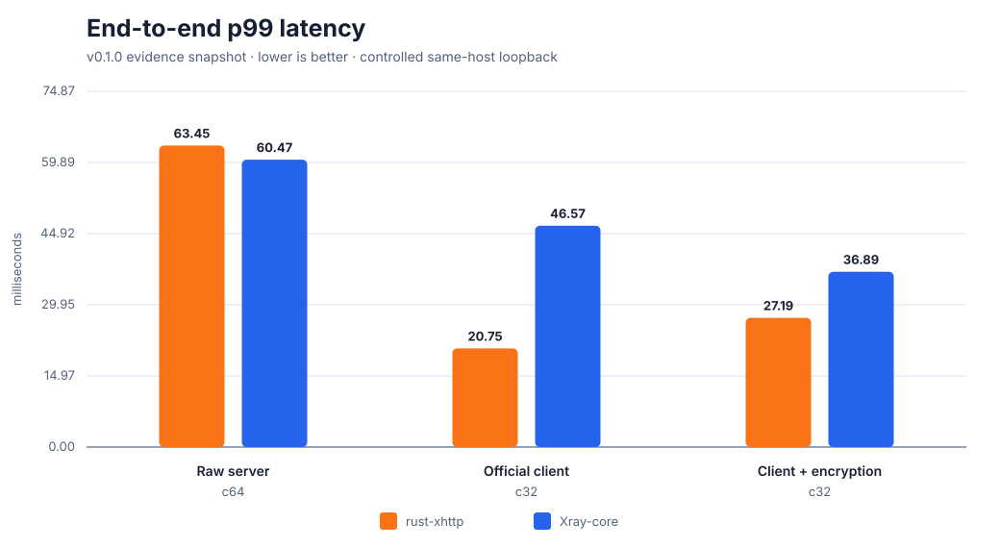
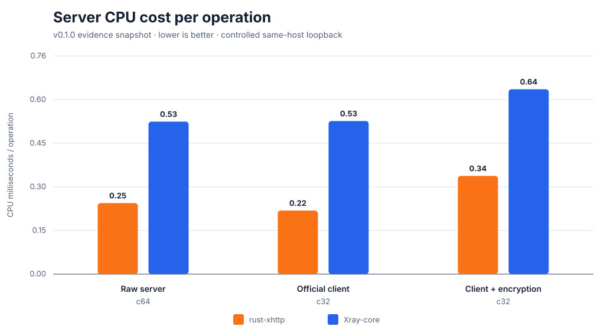

# Benchmark 与 Xray-core 对比

[English](benchmarks.md) | 简体中文

本页严格区分“已提交证据”和“性能声明”。选入 v0.1.0 的结果均在同一台主机的
loopback 上，对两个服务端使用相同负载并逐字节校验。它们是实现测量，不是公网
速度保证，也不能替代在实际部署主机上的测试。

## v0.1.0 证据快照

| 工作负载 | 指标 | rust-xhttp | Xray-core | Rust/Xray |
| --- | --- | ---: | ---: | ---: |
| Raw server，c64，5,000 ops，4 KiB | ops/s | 1,567.84 | 1,558.39 | **1.006×** |
| | p99 延迟 | 63.45 ms | 60.47 ms | 1.049× |
| | 服务端 CPU/op | 0.246 ms | 0.528 ms | **0.466×** |
| | 最终服务端 RSS | 27.2 MiB | 110.3 MiB | 0.246× |
| 官方 Xray 客户端，c32，1,000 ops，4 KiB | ops/s | 3,305.59 | 2,592.52 | **1.275×** |
| | p99 延迟 | 20.75 ms | 46.57 ms | **0.446×** |
| | 服务端 CPU/op | 0.220 ms | 0.530 ms | **0.415×** |
| | 最终服务端 RSS | 27.5 MiB | 139.7 MiB | 0.197× |
| 官方客户端 + VLESS-Encryption，c32，1,000 ops，4 KiB | ops/s | 3,147.01 | 2,587.61 | **1.216×** |
| | p99 延迟 | 27.19 ms | 36.89 ms | **0.737×** |
| | 服务端 CPU/op | 0.340 ms | 0.640 ms | **0.531×** |
| | 最终服务端 RSS | 29.3 MiB | 154.8 MiB | 0.189× |

“Raw server” 使用仓库内直接 HTTP/VLESS 测试架。“官方 Xray 客户端”在两个候选
服务端前分别启动未经修改的 Xray SOCKS 客户端，因此客户端 XHTTP 行为相同，只有
服务端实现发生变化。






只有 ops/s 是越高越好；延迟和 CPU 成本越低越好。图表生成器只依赖 Python
标准库：

```bash
python3 scripts/render_benchmark_charts.py
git diff --exit-code -- docs/assets/
```

## 证据文件

图表输入从本地测试架输出原样提交：

- [Raw server c64 JSON](../benchmarks/v0.1.0/raw-server-c64.json)
- [官方客户端 c32 JSON](../benchmarks/v0.1.0/official-client-c32.json)
- [官方客户端 + encryption c32 JSON](../benchmarks/v0.1.0/official-client-encryption-c32.json)

每个 JSON 都记录负载大小、并发、完成操作数、wall time、延迟分布、进程 CPU、
RSS、协议拓扑与比较比值。证据中的临时本地端口不是结果的一部分。

## 方法与限制

- 每个操作创建一个 XHTTP 会话，向本地 echo/HTTP 源站发送 VLESS TCP 请求，并
  校验完整响应载荷。
- Payload MiB/s 将上行和下行各计一次。对于这些 4 KiB 短会话建立负载，`ops/s`
  更有解释力。
- CPU 来自测量窗口前后的进程计数；极短窗口量化误差很大，因此头条只使用较长的
  c32/c64 运行。
- RSS 是某一时刻的进程读数，不是 peak RSS，也不是 allocator resident 内存。
- 选定文件都是 2026-06-19 的单次运行。内嵌环境只记录 Docker host networking
  与 Python 3.13.13，没有保存精确 CPU、内核、Xray 版本/提交、二进制 SHA、温度/
  频率状态或重复样本离散度。
- 当前主机还承担其他开发任务。本项目不把这些快照包装成论文级容量数据；未来版本
  应以隔离的重复采样和完整身份元数据替换。

因此结论刻意保持狭窄：在这些已记录运行中，raw c64 路径吞吐基本持平且
rust-xhttp 服务端 CPU 更低；两个官方客户端 c32 路径中 rust-xhttp 更快且服务端
CPU 更低。

## 复现

需要 Docker、本地可执行官方 `xray`、Linux host networking、Python 3，以及能
构建 release 的 Rust 工具链。

Raw VLESS-over-XHTTP 服务端对比：

```bash
XRAY_BIN=/path/to/xray \
OPS=5000 WARMUP=200 CONCURRENCY=64 PAYLOAD_BYTES=4096 \
bash scripts/m11_docker_xray_perf.sh
```

在两个候选服务端前使用官方 Xray 客户端：

```bash
XRAY_BIN=/path/to/xray \
OPS=1000 WARMUP=100 CONCURRENCY=32 PAYLOAD_BYTES=4096 \
bash scripts/m12_docker_xray_client_perf.sh
```

使用新生成配对 VLESS-Encryption 值的同一官方客户端对比：

```bash
XRAY_BIN=/path/to/xray VLESS_ENCRYPTION=1 \
OPS=1000 WARMUP=100 CONCURRENCY=32 PAYLOAD_BYTES=4096 \
bash scripts/m12_docker_xray_client_perf.sh
```

新报告写入已忽略的 `local/artifacts/`。发布替代结果前，每个 cell 至少交错运行
5 次，记录两侧二进制哈希和源码提交，固定 Xray 版本，保存 CPU/内核/内存/电源
策略，确认零失败，再把原始证据与图表一起提交。

## 微基准

Criterion 套件测量 XHTTP 分类及 XUDP/UDP framing 内核：

```bash
scripts/bench.sh
```

Criterion 适合发现局部回归，但不能直接与 Xray-core 的端到端服务端进程对比。
